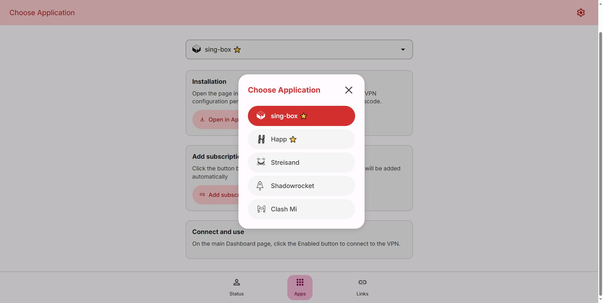
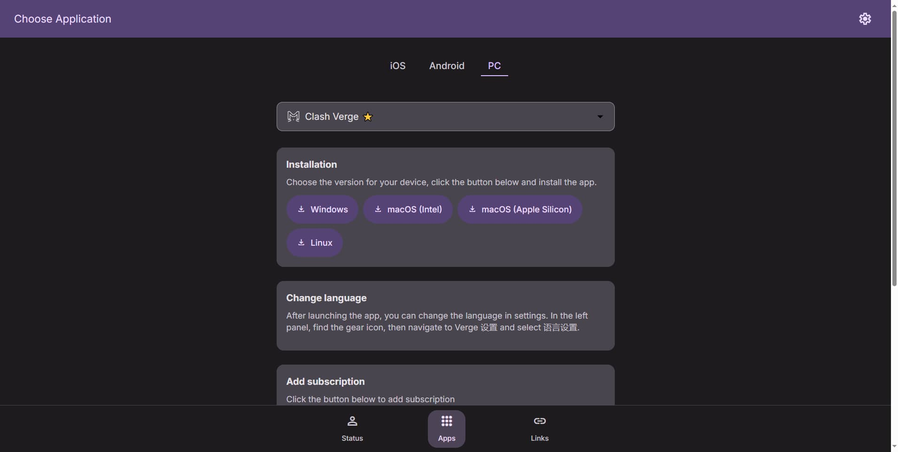
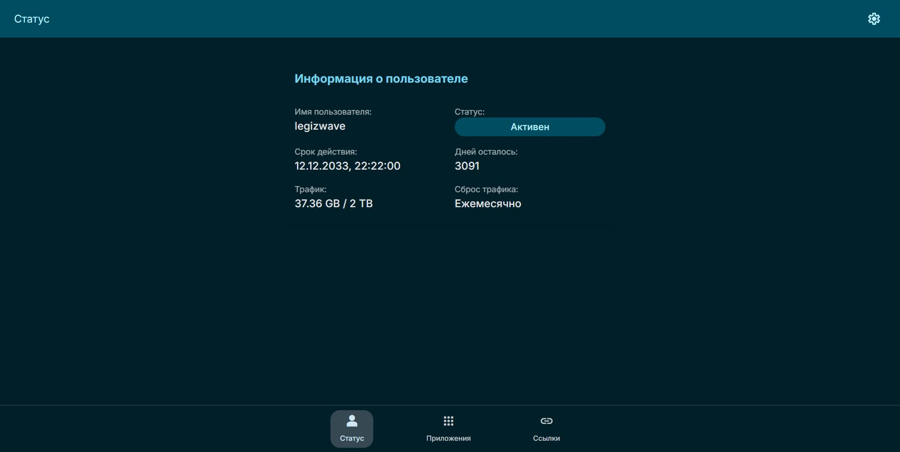
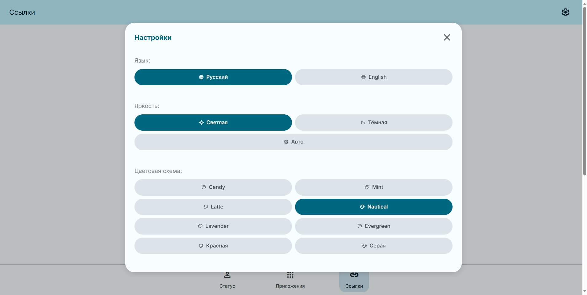
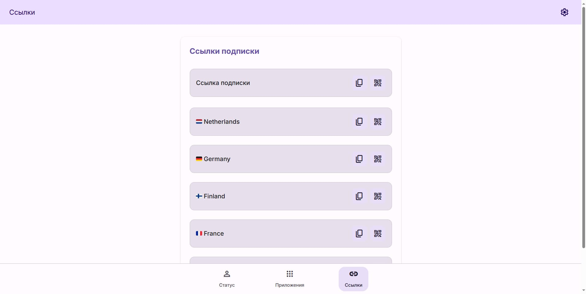

[Русская версия](README.md)

# Material Remnawave Subscription page

This repository contains the source code for the subscription page of the Remnawave proxy panel, designed in a modern Material Design 3 style. The page provides users with convenient access to subscription information, connection instructions, and links. The code was written with the help of the Claude Sonnet 4 AI model.

## Key Features

* **Material 3 Design:** A modern and intuitive user interface developed in accordance with the latest Material Design 3 principles.

* **Dark and Light Theme Support:** Automatic or manual switching between light and dark themes for comfortable use in any lighting conditions.

* **Flexible App Configuration:** Supports a standard list of recommended applications for connection, as well as easy integration of third-party clients via a [customizable `app-config.json`](https://remna.st/docs/install/remnawave-subscription-page#custom-app-configjson-custom-apps) file.
* * **Custom Groups**  
The ability to add additional groups to the apps section via the integration file, [for example, the `TV section`](https://github.com/legiz-ru/my-remnawave/blob/main/sub-page/multiapp/app-config.json).


* **Individual Link Copying:** Ability to copy individual links (e.g., `vless://`, `trojan://` ) directly from the page, in addition to the main subscription link.

* **Multi-language Support:** Page available in Russian and English with automatic browser language detection.

## Screenshots

<div align="center">
  
  
  
  
  
</div>

## Installation

1. **Download the page file:**
   Download the `index.html` file to the same directory where your `docker-compose.yml` is located, using `curl`:

   ```bash
   curl -o index.html https://raw.githubusercontent.com/legiz-ru/material-remnawave-subscription-page/refs/heads/main/index.html
   ```

2.  **Configure Docker Compose:**
    Specify the path to the downloaded `index.html` in your `docker-compose.yml` by mounting `volumes` into the `remnawave-subscription-page` container.

    Example for a standard installation:

    ```yaml
    services:
      remnawave-subscription-page:
        volumes:
          - ./index.html:/opt/app/frontend/index.html
    ```

    If you plan to use a [custom application list](https://remna.st/docs/install/remnawave-subscription-page#custom-app-configjson-custom-apps) (`app-config.json`), add the corresponding `volume`:

    ```yaml
    services:
      remnawave-subscription-page:
        image: remnawave/subscription-page:latest
        volumes:
          - ./index.html:/opt/app/frontend/index.html
          - ./app-config.json:/opt/app/frontend/assets/app-config.json
    ```

    You can use one of my custom application lists, available at: [Custom App List](https://github.com/legiz-ru/my-remnawave/blob/main/README.md#remnawave-subscription-page-%D1%81lient-configuration)

3.  **Restart the container:**
    To apply the changes, restart your Docker container:

    ```bash
    docker compose down remnawave-subscription-page && docker compose up -d remnawave-subscription-page
    ```

## Contact

  * [Telegram Channel](https://t.me/legiz_trashbag)

## Support the Project

If you like this project and want to support its development, you can make a donation:

  * [Tribute on Telegram](https://t.me/tribute/app?startapp=drzu)
  * [TON USDT: `UQAGQTQZYCx5TWj5cmTLpo7164PFsXqZZJ6t6x88n7sHW9gU`]

<!-- end list -->
